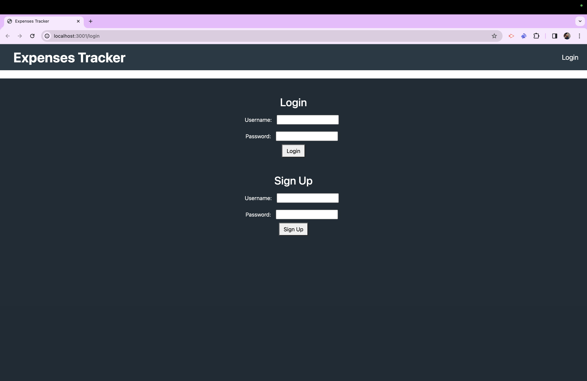
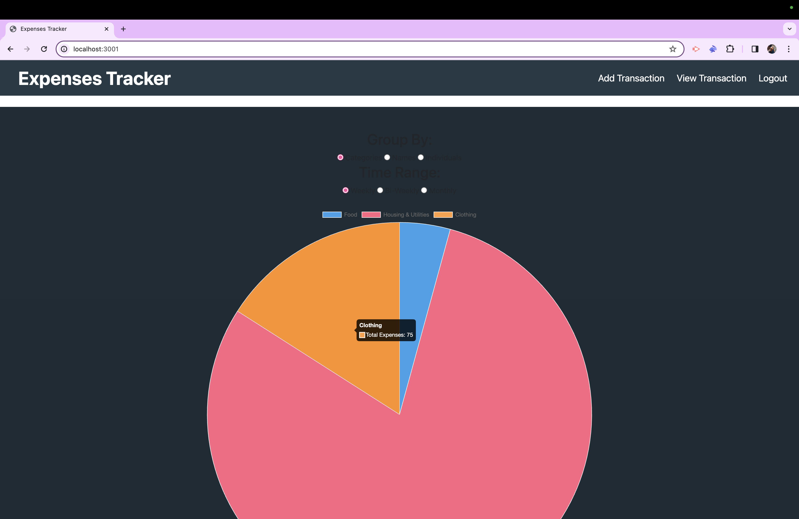

# Expenses Tracker

## Description
This project is a full-stack application built with JavaScript, Handlebars.js, and MySQL that you can use in your daily life. Since almost everyone uses money daily and could probably be a little better at spending less/saving more, we decided an expenses tracker would be useful to most. We are targeting people that spend money and want more knowledge of what kind of things they buy the most, or how much they have leftover to spend/save. How we do this is by having the customer input there transactions and show a categorized pie chart custom to your spending.

## Table of Contents
- [Usage](#usage)

- [Credits](#credits)

- [License](#license)

## Images/Links/Videos

## Usage
To use this application you need to click on the link to the website, then log in or sign up for our website. Once you are in, it should take you to the homepage with an add transaction input. You will then need to look at your banking info and input all the transactions for the week, whether it is money coming in or money going out. Once you have input all transactions for the week and their category, then you will see a pie chart with those categories and what percent of your money you spent on each category. There is also a place for you to look at all transactions you have put in, or edit/delete transactions if needed.

## Credits
- [Chart.js]( https://www.chartjs.org/)
- [Handlebars.js](https://handlebarsjs.com/)
- [Node.js](https://nodejs.org/en)
- [Bootstrap](https://getbootstrap.com/)
- [Express.js](https://expressjs.com/en/resources/template-engines.html)
- [npm](https://docs.npmjs.com/)

## License
Check out the MIT License in our repository for more information about the licensing for this project!